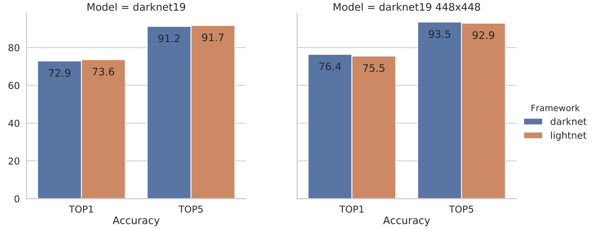
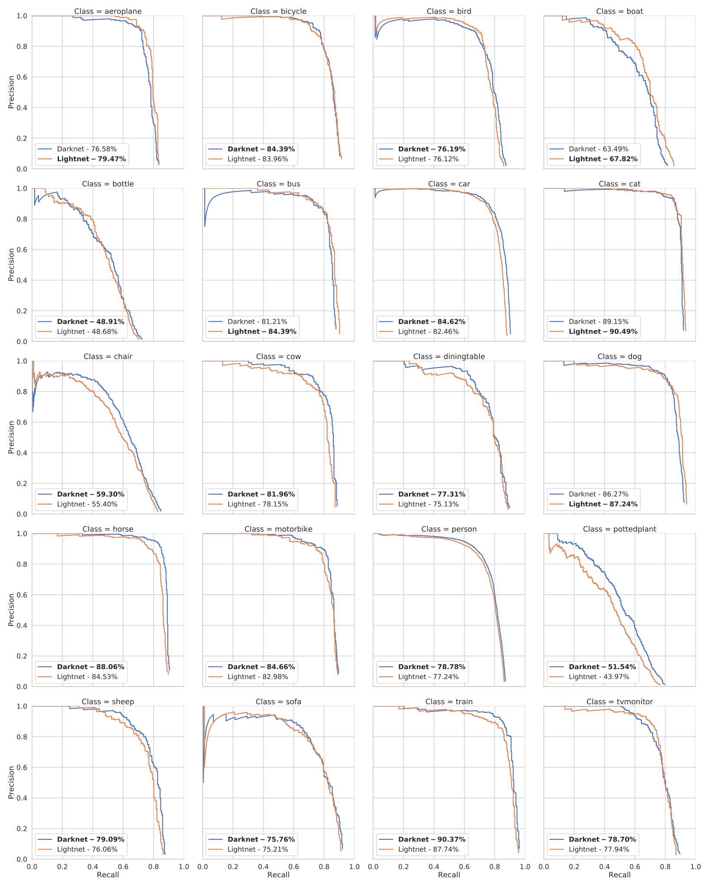

.. _accuracy:

Comparing accuracy
==================
In this document we will compare the accuracy of networks running in this library and in darknet_.

ImageNet
--------
We went through the hassle of training darknet19 on ImageNet from scratch, to be able to compare the results with the darknet framework.
As you can see, lightnet achieves about the same results as darknet for this task. |br|

VOC
---

.. Todo::
   - Change weight

We compared the Yolo V2 network on the Pascal VOC imageset.
For more information on how to recreate these results, take a look at *examples/yolo-voc* in the lightnet_ repo.

We trained the network two times, once with pretrained darknet weights and once with weights from our own ImageNet training.
While the difference is not that big, the pretrained weights from lightnet offer slightly better results,
proving that there is a small difference in how PyTorch and Darknet compute some layers.
*(Our guess is that it is most likely the batch-norm layers)*

========= ======= ================== ===============================================
Framework mAP (%) Weight File        Note
========= ======= ================== ===============================================
Darknet   76.8    `weights <dnw_>`_  Darknet weights with Lightnet evaluation code
--------- ------- ------------------ -----------------------------------------------
Lightnet  74.6    `weights <lnw_>`_  Transfer learned from Darknet ImageNet weights
--------- ------- ------------------ -----------------------------------------------
Lightnet  75.8    `weights <plnw_>`_ Transfer learned from Lightnet ImageNet weights
========= ======= ================== ===============================================

.. include:: ../links.rst
.. _darknet config: https://github.com/pjreddie/darknet/blob/777b0982322142991e1861161e68e1a01063d76f/cfg/yolo-voc.2.0.cfg
.. _dnw: https://pjreddie.com/media/files/yolov2-voc.weights
.. _lnw: https://mega.nz/#!mhMzQIhB!K8i1rDAFO78dkQNGepwcmz6N4EzTPMEXuarC7luGAWs
.. _plnw: https://mega.nz/#!HwUlCIxA!OhdkRK5GkVdFDgfh9QPbHx7961-jSZnpMOotttakPU4
