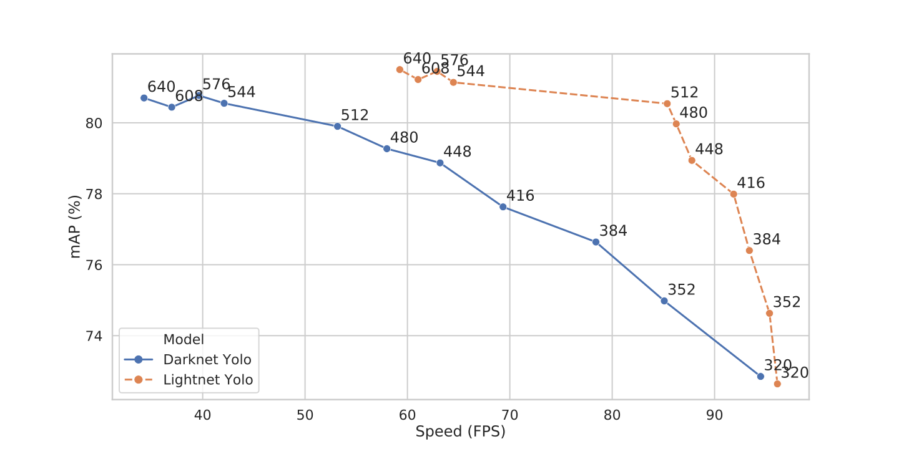

Comparing speed
===============
In this document we will compare the speed of various tasks, performed between networks of this library, of `pytorch-yolo2`_ and of `darknet`_.

Inference speed
---------------
We compared the Yolo V2 network on the Pascal VOC testset for both lightnet and darknet at different input resolutions.
Inference was timed as :math:`T_{forward\ pass\ network} + T_{get\ region\ box} + T_{non-maxima\ suppression}`.
Loading of the images, preprocessing and further postprocessing were not included.
For the sake of consistency, we used the same darknet weights for both frameworks. |br|
The following graph shows the results of the experiment on an Nvidia GTX 1080 Ti.

.. Note::
   The inference was tested one image at a time.
   Using a bigger batch size can speed up the inference time quite heavily, but as it is usually not doable in real scenarios,
   we decided to measure the speed for a batch size of 1.

Training speed
--------------

We measured the time it took to train the Yolo V2 network on the Pascal VOC dataset. |br|
For this we measured total time of training and divided it by the number of batches (64 images) trained for.
You can find the method of measuring in the `training example script`_. |br|
The following table shows the results of the experiment on a Nvidia GTX 1080 Ti. |br|

.. Note::
   If anyone has measured the time needed to train on Pascal VOC in darknet,
   feel free to send me the results. (Preferably on an Nvidia GTX 1080 Ti)

==================== ======= ========
Metric               Darknet Lightnet
==================== ======= ========
Time per Batch (s/b) *TBD*   1.484
==================== ======= ========

.. include:: ../links.rst
.. _training example script: https://gitlab.com/EAVISE/lightnet/blob/master/examples/yolo-voc/train.py
